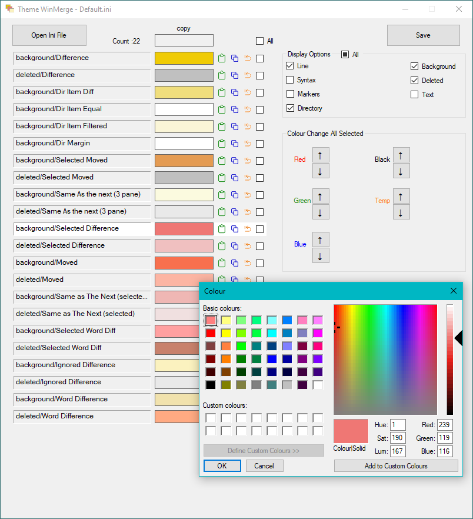

# Theme WinMerge
This utility provides a way to design colour schemes for WinMerge. WinMerge's Option page is not that easy to work with since it only displays some of the colours used at any one time and does not provide any way to change colours en-masse. This utility opens and saves the ini files which can be found in one of two places depending on how WinMerge is installed.

 - System Wide install, the ini files are found in %ProgramFiles%\WinMerge\ColorSchemes but files in this folder can only be edited by an Admin.
 - Portable app install, the ini files are found in %localappdata%\Programs\WinMerge\ColorSchemes

# Usage
 - If WinMerge was a System Wide Install, copy the ini file to somewhere else while working on it, then copy it back with Admin permissions.
 - Portable app install, the ini files can be worked on directly.
 - Make a backup copy before editing or save as a different file name.

## Display Options
 - "All" shows all entries with the word "color" in them.
 - "Line" colours have Background, Deleted and Text colours. This means the background to a line difference, the background to a deleted line, and the text font colour used for line differences.
 - "Syntax" and "Markers" don't have other options.
 - Directory has Background and Text options.
 - System Hook has Background and Text options.

## List of Items
Each colour item found in the ini file is filtered according to the Display Options and shown in the list.

Clicking on the colour box brings up the standard Windows colour dialog, so you can select or adjust the colour and click Ok. You can also enter decimal values for Red, Green, Blue or Hue, Saturation, Luminance which can be useful for copying colours from elsewhere. To pick up a colour from elsewhere on your screen, use another program like [Meazure](https://github.com/cthing/meazure) which can show RGB values. You do not need to add the new colour to the custom colours.

Next to the colour box are Paste, Copy and Revert icons, then a select checkbox.

 - Paste - Pastes from the copy colour box. Does not use the Windows clipboard.
 - Copy - Copies to the copy colour box.
 - Revert - Reverts the colour box to the value from when the file was opened. If you want to revert all, it is quicker to reopen the file.
 - Checkbox - Selects that item to be adjusted with the Colour Change All Selected controls.

## Colour Change All Selected
Every item with the checkbox ticked will be affected by these controls.

 - Red, Green, Blue arrow buttons nudge the primary component up or down by 2 steps until it hits 0 or 255.
 - Black arrow buttons nudge all three primaries by 2 steps until they hit 0 or 255 each.
 - Temp arrows adjust the colour temperature - up is warmer by adding 2 steps to red and removing 2 steps from blue, down is the opposite.

## System Hook Colors
Not all themes support System Hook Colors, the flag is `Settings/SysColorHookEnabled`  
WinMerge seems to only pick up some of these colors, others are set by your Windows colour scheme.  
The colours are set in a single line entry containing all the colours with a key system which is commented at the end of the file. Note that this program picks up the colours from the entry not the comments and rewrites the comments according to the colours in the entry. This results in a few discrepancies when opening and saving the default files without making any changes, which is because the comments were wrong.  
Do not remove the comment lines in the theme files, though, because they are used for the mapping.  

 - Active Caption and Inactive Caption are used for diff pane headings.
 - Window background is used for example in the find result dialog when not found.
 - Window Text is used for app title bar text
 - 3D Highlight is used for the titlebar background and app title background
 - 3D Face is used for pane borders and titlebar, and in other places such in the Not Found dialog box surrounding the OK button and when mouseover the top level menu items (File etc)
  - Button Text is used for top level menu item text
  - Gradient Active and Inactive Captions are used for location and diff pane background of captions
  - Others appear to not be used/implemented but are listed for completeness. If you find the use of these, please either update this document or raise a github issue.

## Installation
No installer is provided because the program consists of a single [executable](ThemeWinMerge/bin/release/ThemeWinMerge.exe) which has no dependencies other than what is standard on a Windows 10 installation.

## Source Code
Written in C# as a WinForms application using .NET Framework 4.7.2 in Visual Studio 2019  
No third party components are used.  

## Credits
Copy, Paste, Revert icons were generated with [iconoir](https://iconoir.com/)  
App icon is mine, drawn from the WinMerge options dialog with the default colour scheme and converted to an icon using [IcoFx 1.6.4](https://icofx.ro/)  
Temp adjustment calculation from [Tanner Helland](https://tannerhelland.com/2014/07/01/simple-algorithms-adjusting-image-temperature-tint.html)  
Techniques to speed up redrawing from StackOverflow.  
